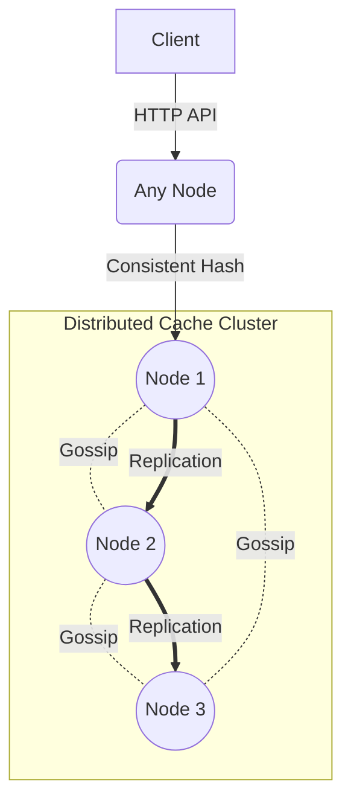

# Distributed Cache System


A production-grade, highly available, and horizontally scalable distributed caching system written in Python. This project implements a decentralized AP (Available/Partition-tolerant) cache using consistent hashing, leader-follower replication, and SWIM-lite gossip protocol for cluster membership.

## Architecture Overview



## Features

* **Fully Decentralized**: No single point of failure; every node can route requests.
* **Consistent Hashing**: Virtual nodes (150 per physical node) for even data distribution.
* **SWIM-lite Gossip Protocol**: Efficient $O(\log N)$ cluster membership and failure detection.
* **Leader-Follower Replication**: Configurable replication factor with background sync.
* **O(1) Eviction Policies**: Pluggable LRU and LFU eviction mechanisms.
* **Prometheus Metrics**: Built-in observability.

## Quick Start

Start a 3-node cluster using Docker Compose:

```bash
cd docker
docker-compose build
docker-compose up -d
```

Check the health of the cluster:
```bash
curl http://localhost:8001/cluster/status
```

## API Reference

### Cache Operations

| Method | Path | Description |
|--------|------|-------------|
| `PUT` | `/cache/{key}` | Set a key-value pair. Request body: `{"value": "data", "ttl": 60}` |
| `GET` | `/cache/{key}` | Get a value by key. Returns 404 if not found. |
| `DELETE` | `/cache/{key}` | Delete a key from the cache. |
| `HEAD` | `/cache/{key}` | Check if a key exists (returns 200 or 404). |

### Cluster & Observability

| Method | Path | Description |
|--------|------|-------------|
| `GET` | `/cluster/status` | Get full cluster topology and health. |
| `GET` | `/cluster/nodes` | List all nodes and their gossip states. |
| `GET` | `/health` | Basic node healthcheck and uptime. |
| `GET` | `/metrics` | Prometheus formatted metrics. |

## Configuration Reference

Configuration is managed via environment variables:

| Environment Variable | Default | Description |
|----------------------|---------|-------------|
| `DCACHE_NODE_ID` | `node1` | Unique identifier for the node. |
| `DCACHE_HOST` | `0.0.0.0` | Bind host address. |
| `DCACHE_REST_PORT` | `8000` | Port for the REST API. |
| `DCACHE_GRPC_PORT` | `50051` | Port for the gRPC interface. |
| `DCACHE_MAX_KEYS` | `10000` | Max keys per node before eviction. |
| `DCACHE_EVICTION_POLICY` | `lru` | Eviction policy (`lru` or `lfu`). |
| `DCACHE_DEFAULT_TTL` | `0` | Default TTL in seconds (0 = never expire). |
| `DCACHE_REPLICATION_FACTOR`| `2` | Number of nodes to replicate data to. |
| `DCACHE_GOSSIP_INTERVAL_MS`| `1000` | Gossip protocol ping interval. |
| `DCACHE_SUSPICION_TIMEOUT_MS`| `5000` | Time before a suspected node is marked dead. |
| `DCACHE_SEED_NODES` | `""` | Comma-separated list of seed nodes to join. |
| `DCACHE_VNODES_PER_NODE` | `150` | Virtual nodes for consistent hashing. |
| `DCACHE_REAPER_INTERVAL_SECONDS` | `1.0` | Interval for TTL expiration reaper. |
| `DCACHE_LOG_LEVEL` | `INFO` | Log verbosity. |

## Client Library Example

Using Python `httpx`:

```python
import httpx
import asyncio

async def main():
    async with httpx.AsyncClient(base_url="http://localhost:8001") as client:
        # Set a value
        await client.put("/cache/mykey", json={"value": "myvalue", "ttl": 300})
        
        # Get a value
        resp = await client.get("/cache/mykey")
        print(resp.json()) # {"key": "mykey", "value": "myvalue", "found": true, ...}
        
asyncio.run(main())
```

## Running Tests
```bash
pytest tests/ -v
```

## Load Testing
Use the built-in async benchmark tool to test throughput and latency percentiles:
```bash
python -m benchmarks.load_test --nodes http://localhost:8001,http://localhost:8002,http://localhost:8003 --clients 50 --operations 5000
```

## Project Structure
```text
.
├── docker/                 # Dockerfile and compose configs
├── docs/                   # Architecture and scaling documentation
├── src/                    # Source code
│   ├── api/                # REST API and models
│   ├── cluster/            # Coordinator, hash ring, gossip, replication
│   ├── core/               # Eviction, store, entry management
│   ├── metrics/            # Prometheus metrics
│   └── config.py           # Configuration management
└── tests/                  # Pytest test suites
```
