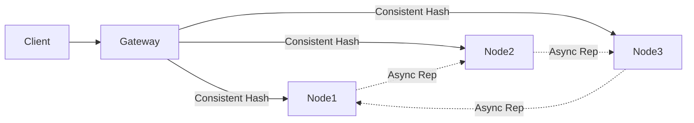

# How This Scales: Distributed Cache Architecture

## 1. Executive Summary
This document outlines the scalability and operational characteristics of our distributed caching tier. Designed as an AP (Available/Partition-tolerant) system, the architecture avoids single points of failure, ensures sub-millisecond local read latencies, and provides linear horizontal scalability by combining consistent hashing, asynchronous replication, and decentralized gossip membership.

## 2. Current Architecture

**Key Numbers:**
- **Lookup Latency**: $O(1)$ local, network-bound remote.
- **Routing Latency**: $O(\log V)$ where $V$ is total virtual nodes (typically $< 10\mu s$).
- **Gossip Convergence**: $O(\log N)$ gossip intervals to propagate state.

## 3. Horizontal Scaling Strategy

### Write Scaling
Write throughput scales linearly with the number of nodes. The consistent hash ring shards the keyspace uniformly. Adding more nodes automatically redistributes the keys, spreading out hot write partitions. 

### Read Scaling
By increasing the `DCACHE_REPLICATION_FACTOR`, we create more followers for any given key. In high read-throughput scenarios, client routing logic or the gateway can be modified to serve reads from follower replicas, distributing the read load.

### Memory Scaling
Total memory capacity is simply $\sum \text{Memory}(\text{Node}_i)$. Adding a node instantly increases the overall cluster capacity, while the eviction policies (LRU/LFU) strictly bound individual node memory usage.

## 4. Failure Handling

### Detection
The SWIM-lite gossip protocol provides robust, decentralized failure detection. Nodes exchange periodic pings. If a node becomes unresponsive, the cluster converges on a `DEAD` state in $O(\log N)$ time, avoiding centralized coordinator bottlenecks.

### Recovery
When a node fails, the consistent hash ring is updated locally on all surviving nodes. Keys previously mapping to the dead node automatically fall to the next node on the ring. Follower nodes for those keys instantly become the new primaries.

### Partial Failures
As an AP system, partial network partitions do not halt the cluster. Separated partitions will continue to serve requests for their local key spaces, eventually merging state (with some potential data loss on conflict) when the partition heals.

## 5. Performance Characteristics
- **Cache Operations**: All underlying storage operations (`GET`, `SET`, `DELETE`) are strictly $O(1)$.
- **Ring Lookups**: $O(\log V)$ via binary search (`bisect`), ensuring fast request routing.
- **Latency**: 
  - **Local Hits**: Sub-millisecond (limited only by Python's asyncio overhead).
  - **Remote Hits**: Dominated by internal network latency ($1-3$ ms).

## 6. Known Bottlenecks & Mitigations

| Bottleneck | Impact | Mitigation Strategy |
|------------|--------|---------------------|
| **Python GIL** | Limits strict CPU parallelism for concurrent requests. | Run multiple processes per machine or migrate core data structures to Rust via PyO3/FFI. |
| **Full Sync on Join** | Network saturation when large nodes join. | Implement incremental sync using merkle trees or append-only replication logs. |
| **Gossip Time** | Large clusters ($1000+$ nodes) take longer to detect failure. | Tune `suspicion_timeout` and `gossip_interval` dynamically based on cluster size. |

## 7. Comparison with Redis Cluster

| Feature | This System | Redis Cluster |
|---------|------------|---------------|
| **Architecture** | Decentralized, AP | Coordinated via slots, CP-ish |
| **Keyspace Map** | Consistent Hashing Ring | 16384 Static Hash Slots |
| **Membership** | SWIM-lite Gossip | Redis Cluster Bus |
| **Thread Model** | Async IO (Python) | Single-threaded (C) |

**Where this system differs:**
Our system uses true consistent hashing rather than fixed hash slots, meaning node additions don't require heavy slot migration orchestration. 

**What Redis does better:**
Redis is written in C, bypassing the GIL, and offers much higher raw throughput per core. Redis also supports complex data structures (Lists, Sets, Sorted Sets), whereas this system is currently optimized for simple Key-Value blobs.

## 8. Future Improvements
- **Persistent Storage Backend**: Implementing an optional RocksDB or SQLite backend to survive full cluster restarts.
- **Read-Repair**: Asynchronous consistency checks during `GET` requests to fix out-of-sync replicas.
- **Client-Side Caching**: Extending the protocol to support server-assisted client-side caching (like Redis RESP3).
- **Multi-Datacenter Replication**: Adding rack-aware and region-aware replica placement to survive AZ failures.
